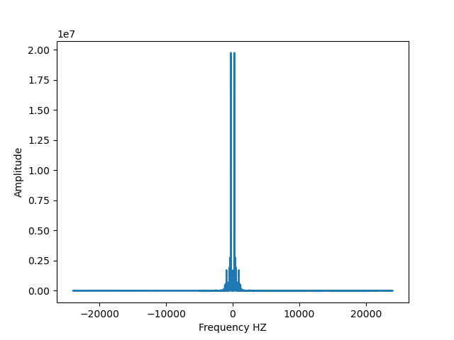
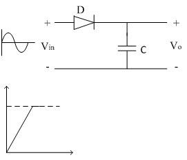

# Peak_detection

Sound waves fade as they spread in space.

In this project we take a fading sound file and pass it through a Python code that can recover the signal and ignore the noises.

Use the project - transmit a signal while an exploding bomb. Know to ignore the momentary noise.

