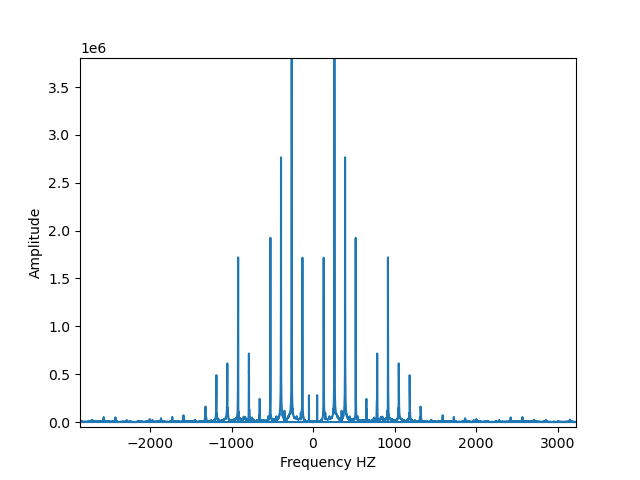
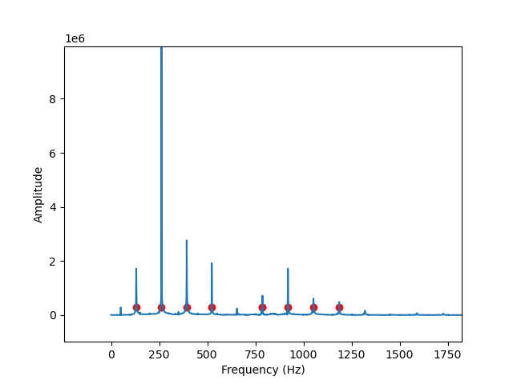
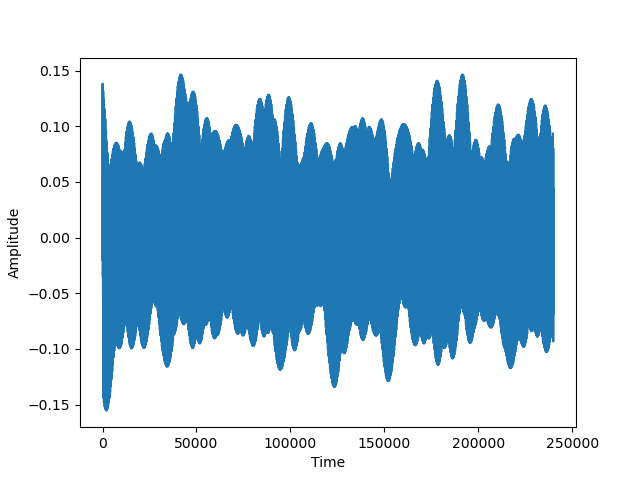

# Peak_detection

Sound waves fade as they spread in space.

In this project we take a fading sound file and pass it through a Python code that can recover the signal and ignore the noises.

One can use the project when transmiting a signal while an exploding bomb. Know to ignore the momentary noise.

# FFT

# Sampling in max

# Average signal

# It can be implemented in a simple way:

